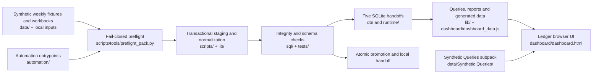
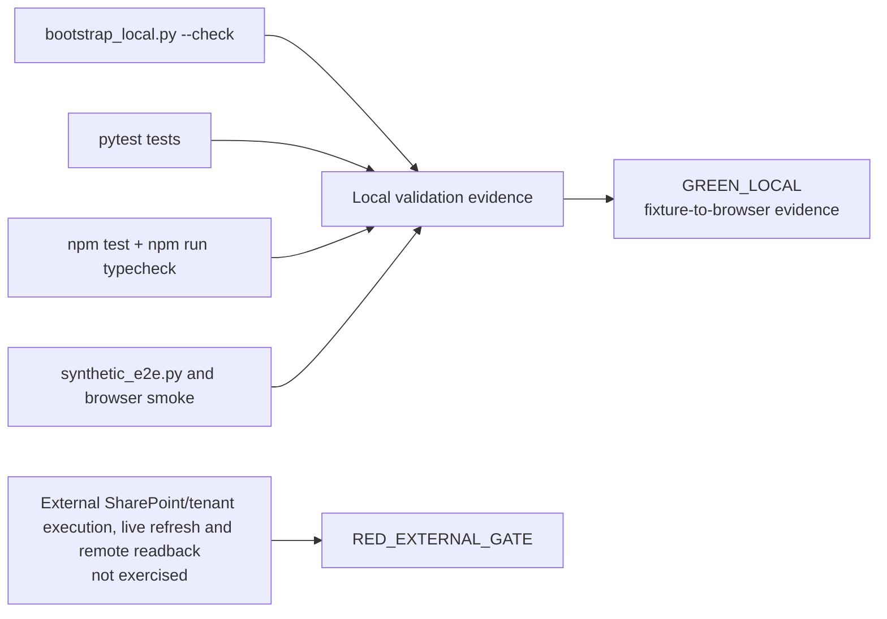

# Architecture and validation map

This document gives a visual map of the public Ledger Dashboard pack. It is documentation only: the UI, ETL, transactional staging, SQL, SQLite handoffs, query subpack and tests are unchanged.

For the cross-repository view, see the [portfolio architecture map](https://github.com/brunotaisa01-source/escalation-app-portfolio/blob/main/docs/PORTFOLIO_MAP.md).

## Runtime flow

Validation is fail-closed: empty input, schema or SQL errors stop the pipeline before database promotion. The browser receives generated local data and does not call a tenant.

## Test and status flow

`GREEN_LOCAL` describes the local commands and fixture scope recorded in the pack. `RED_EXTERNAL_GATE` remains for remote credentials, permissions, scheduling, live refresh, tenant mutation and remote readback. Local evidence must not be promoted to production evidence.

## Main entrypoints

- `python scripts\tools\bootstrap_local.py --check` validates local inputs.
- `python -m pytest -q tests` runs the Python suite.
- `npm run typecheck` and `npm test` check the typed/browser contracts.
- `python scripts\synthetic_e2e.py` runs the local data-to-browser path.
- `manifest.json` and `runtime/manifests/e2e_latest.json` record local evidence.
